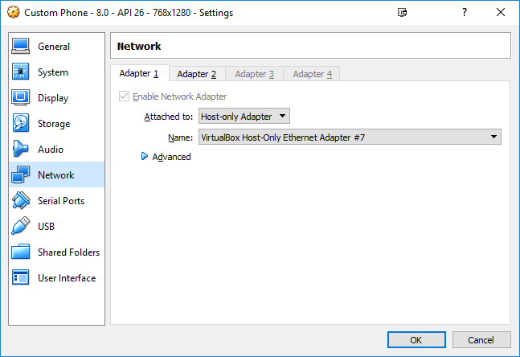
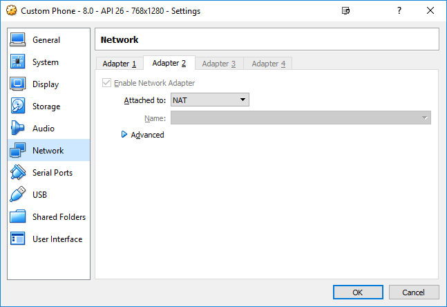
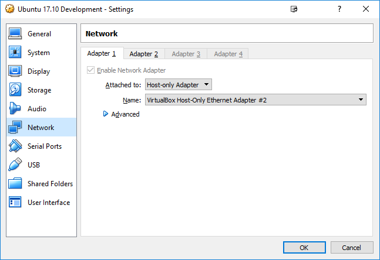
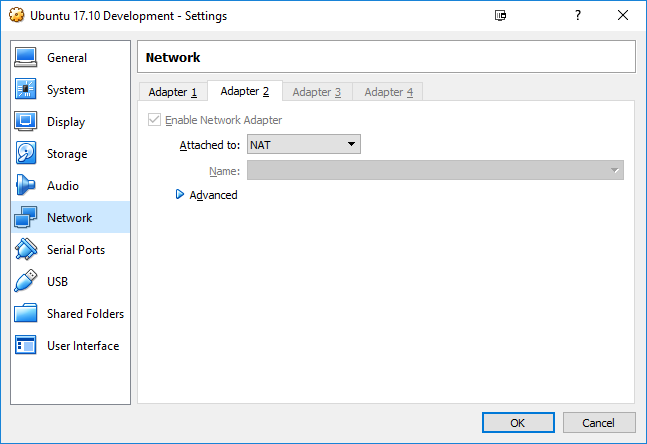
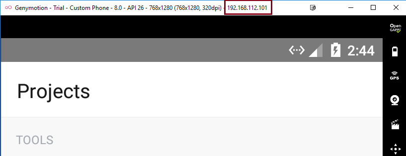

# Introduction
This is a mobile app made with React Native. The app allows user to encode and decode messages within images using
Steganography. This is a rewrite of my dissertation project, written in my third year of university.

# Getting Started

Assuming the following are installed;

    * Android Simulator (Genymotion)
    * Docker/Docker Compose
   
```bash
git clone https://github.com/hmajid2301/Stegappasaurus.git
cd Stegappasaurus
touch .env
docker-compose up --build -d
```

.env file should have the following variables defined
 
```bash
EXPO_USERNAME="username"
EXPO_PASSWORD="password"
ADB_IP="device_ip"
```

## Connecting to Genymotion
 
To connect to Genymotion (using adb);

1) set the following network adapters

    
   
    
    
    ### (Optional) Virtualbox

    If your running ``exp start`` in virtualbox, try setting the following network adapters
     
    
       
    
   
2) Start the Genymotion emulator, the <device_Ip> in the example below is ``192.168.112.101``

    


